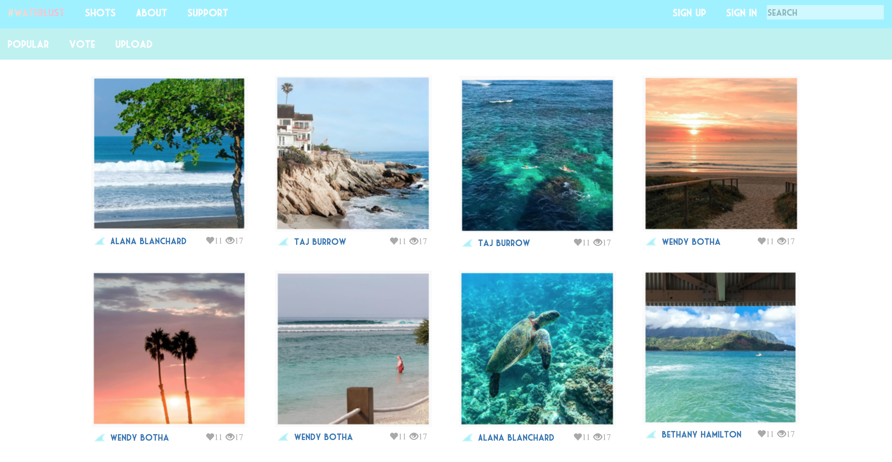
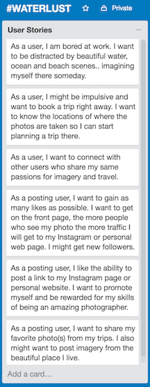
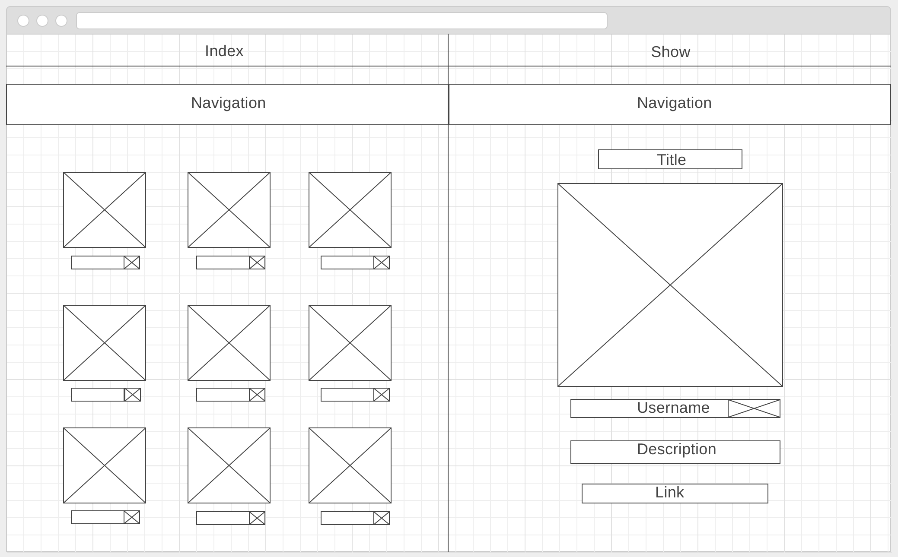

---

-

# #WATERLUST was created for people to share their passion for imagery related to water. Inspired by an Instagram hash, #WATERLUST is home for water lovers to quench their thirst for travel inspiration.

## Objective:

<i>'#WATERLUST'</i> is a place for people to share water & travel related photography. Target users: (1) individuals in search of beautiful water related locations to visit (2) people bored at work, school or home, looking for eye candy to distract themselves (3) seasoned travelers and photographers looking to share information and photos in exchange for promotion. Personal insight + enticing photography is what makes #WATERLUST unique.  

## Development:

<i>'#WATERLUST'</i> is built with Ruby On Rails, HTML5, CCS3 & SASS.

Plus the awesome GEMS: Simple Form, Devise and Paperclip.

## User stories:

## Wireframes:

## Dream features:
- Mobile responsivity
- Add private messaging system and profiles
- Create more interactivity for users & content
- Flight booking links
